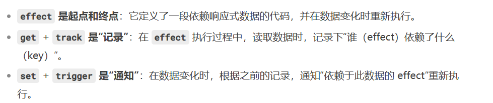

#  刨析Vue3.4


####  vue3设计理念


虚拟dom跨平台好，算法高级


编译时是开发打包，运行时是在浏览器上运行


  vue3的组成


vue3对ts的支持非常强，可以做到很多东西


####  搭建开发环境


羞耻的提升，默认把依赖拍平到node_modules下

而不是直接展示

 处理一些模块的关系,构建vue的核心模块的框架

再去搭建esbuild，就完成了基本的构建了


####  手写reactive

vue3响应式数据和弦通过proxy来实现响应式数据变化


COmpostionAPI是vue2的没必要用了


effect就是数据变化了执行一次，这个数据要是reactive的东西

需要进行其他收集选项

初始化调用一次，后面变化的时候调用一次


#####  依赖收集原理

 


####  设计computed

计算属性：执行后的结果是一个ref不可变的

多次访问此属性，只会执行一次，优化好，里面有一个变量（dirty）来控制执行一次（变成false），数据变化会重置这个变量（变成true）

计算属性也是一个effect，依赖的属性会收集这个计算属性，当值发生变化的时候，会让computedEffect里面的dirty变成true

也有依赖收集的功能，初始化的时候执行一次effect，更新的时候还是会执行effect

在computed返回的属性里面

它自身在赋值变化中是不可变的，它是改变了其他人


> 计算属性aliasName,计算属性依赖的值name
>
> 计算属性也是一个effect,有一个标识dirty=true,访问的时候会,触发name属性的get方法(依赖收集)
>
> 将name属性和计算属性做一个映射,稍后name变化后会触发计算属性的scheduler
>
> 计算属性可能在effect中使用,当取计算属性的时候,会对当前的effect进行依赖收集
>
> 如果name属性变化了,会通知计算属性将dirty变为true(触发计算属性收集的effect,进行重新渲染)
>
> 


####  watch设计




####  dom设计

1. creteRender我们可以自己创建渲染器，让我们自己提供渲染方法
2. render 用内置的渲染器来进行渲染（渲染dom元素的）
3. h方法可以创建勇敢虚拟dom（type，propsOrChilren，children）

> runtime-dom它的作用就是提供DOM API(提供一系列dom操作的api方法)
> @vue/runtime-dom => @vue/runtime-core => @vue/reactivity


虚拟dom的patch算法


用位运算来进行比对，很节省内存

**h函数可能接收到的情况**

h(类型,属性,儿子)

h(类型,儿子)

1. 两个参数,第二个参数可能是属性,或者虚拟节点

   __v_isVnode

2. 第二个参数是一个数组-儿子

3. 其他情况下,就是属性

4. 直接传递非对象的,文本

5. 出现三个参数时,第二个只能是属性

6. 如果超过三个参数,后面的都是儿子


####  全量diff算法

1. 有key的时候默认开头是一样的，从头部开始比对，再从尾部进行比对，确定不一样的范围，减少比对范围，如果有多余的或者新增的直接操作即可

2. 然后对一些特殊情况进行处理

3. 然后就是有一个最后你要操作的范围

   

   

   复用和倒序比对一些东西

   ​

   ​


####  最长递增子数列

c d e   2,3,4

e c d h    4,2,3,0


[c,d]

[0,1]

//通过上面的两个序列，可以求出来，最终这样的结果，就可以保证某些元素不用移动

要求连续性最强的子序列

贪心算法 + 二分查找


然后就是去找


**实现最长递增子序列**

```javascript
function getSequence(arr){
    const resuilt = [0]
    const p = result.slice(0)
    let start;
    let end;
    let middle;
    const len = arr.length;
    
    for(let i = 0;i<len;i++){
        const arrI = arr[i]
        if(arrI!==0){
            //创建节点,为了vue3处理的
            //拿出结果集对应的最后一项,和我当前这一项来做比对
            let resultastIndex = result[result.length-1]
            if(arr[esultastIndex]<arrI){
                //最后一项是小于这个数,直接把结果集这些放进去,
                p[i] = result[result.length-1]
                result.push(i);
                continue
            }
            //这里有一个二分查找的逻辑,把后面小的去进行替换!
        }
        start = 0;
        end =result.length-1;
        while(start<end){
            middle = (start+end)/2 | 0 //取整
            if(arr[result[middle]]<arrI){
                start = middle + 1
            }else{
                end = middle
            }
        }
        if(arrI<arr[result[start]]){
            p[i] = result[start-1]
            result[satart]=i
        }
    }
    //p为前去节点的列表，需要根据最后一个节点做追踪
    let l = result.length;
    let last = result[l-1]
    while(l-->0){
        result[l] = last
        last = p[last]
        //找到最后一个
    }
    return result
}
```

- 该算法返回的是**索引数组**（对应原数组中的位置），而非实际值。
- 忽略 `0` 的处理（Vue3 中用于标记未处理的节点）。
- 回溯环节确保正确还原序列（仅最后一步需要，因为中间可能发生替换）


####  节点渲染

可能是文本节点

还有多节点的一些实现

如果是文本标签就直接去渲染。如果是一个Fragment标签就代表这是一个多标签，这里还要对卸载的逻辑进行处理，因为没有父节点了，会报错

哪现在就有三种能处理的类型了，分别是元素，文本，标签

